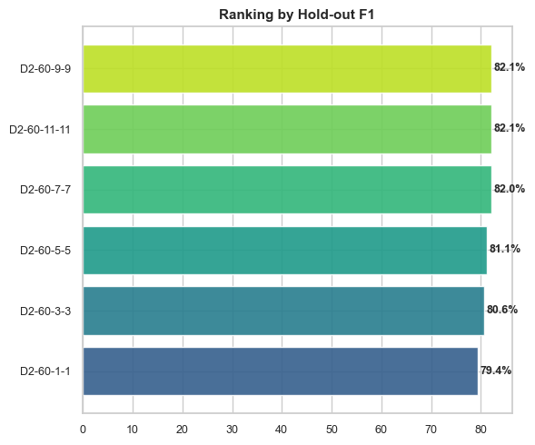
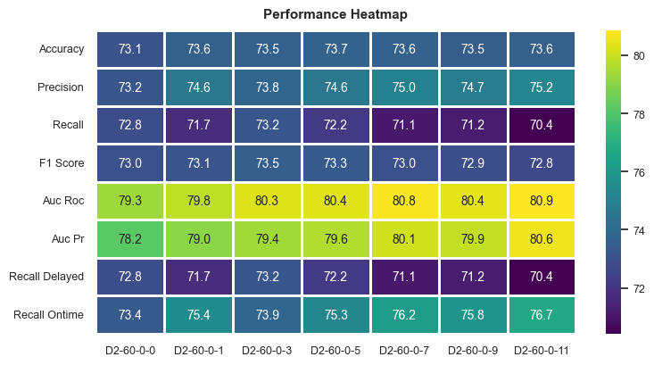

# ✈️ Flight Delay Prediction using Weather Data

[](https://executive-education.dauphine.psl.eu/formations/executive-master-diplome-universite/ia-science-donnees)
[](https://www.scala-lang.org/)
[](https://spark.apache.org/)
[](https://xgboost.readthedocs.io/)
[](https://mlflow.org/)
[](https://www.docker.com/)

A scalable machine learning system for predicting flight delays based on weather conditions using Apache Spark and Scala. Built for the **[EMIASD Executive Master](https://executive-education.dauphine.psl.eu/formations/executive-master-diplome-universite/ia-science-donnees)** (Artificial Intelligence & Data Science, Université Paris-Dauphine \| PSL), by **Naveed Awan, Henri Balamou, Malik Chettih, Zineddine Gherari and Rachna Hean**. The project implements and substantially extends the methodology from the academic paper ["Using Scalable Data Mining for Predicting Flight Delays"](https://www.dropbox.com/s/4rqnjueuqi5e0uo/TIST-Flight-Delay-final.pdf) (Belcastro et al., ACM TIST, 2016) — full write-up in [`Rapport_Projet_Flight_DEC7.pdf`](Rapport_Projet_Flight_DEC7.pdf) (171 pages, 100+ experiments).

---

## 💼 Why this matters — the functional case

Around **20% of airline flights worldwide arrive more than 15 minutes late**. In the US alone, the FAA estimated the economic cost of flight delays at **$32.9 billion in 2007**, over half of it borne directly by passengers through missed connections, lost productivity and extra accommodation. Official delay-cause statistics attribute only ~3% of delays directly to "extreme weather," but once indirect effects are counted — weather-triggered air-traffic-control restrictions, and the knock-on effect of late-arriving aircraft caused by weather at their previous stop — **weather is a contributing factor in an estimated 35-40% of all delays**.

That combination — a large, costly, recurring problem where the main driver is *forecastable* — is what makes flight-delay prediction a genuinely useful ML target rather than an academic exercise. A reliable model built purely from information known *before* departure (schedule, route, airport, weather forecast) can plug into:

- **Booking/travel platforms** — surfacing a delay-risk score next to a flight, similar to price-tracking features.
- **Airport & airline operations** — proactive gate, crew and ground-handling reallocation for flights flagged as high-risk, ahead of the delay actually happening.
- **Passenger-facing tools** — smarter connection-time recommendations, proactive rebooking suggestions.

## 🎯 Project Overview

This system predicts flight delays by analyzing historical flight data combined with weather observations from origin and destination airports. The solution processes large-scale datasets using Apache Spark, implements a rigorous, leakage-aware data preprocessing pipeline, and trains and compares **four classifier families** (Random Forest, Gradient Boosted Trees, Logistic Regression, XGBoost) with cross-validation and grid-search hyperparameter tuning.

### Key Features

- **✅ Scalable Data Processing** - Handles hundreds of thousands of flights with Spark distributed computing
- **✅ Data Leakage Protection** - Centralized, explicit removal of post-flight columns (`ARR_DELAY_NEW`, `WEATHER_DELAY`, `NAS_DELAY`...) before feature extraction
- **✅ Missing-Value Strategy** - Per-hour missing flags + missing-counts for aggregated weather features, sentinel values (`-999` / `"MISSING"`) instead of drops, with a dedicated parquet validation suite
- **✅ Dual Feature Engineering Paths** - PCA (variance-threshold component selection) *or* hybrid statistical feature selection (Chi-Square for categorical, ANOVA F-test for numerical)
- **✅ Multi-Model Pipeline** - Random Forest, Gradient Boosted Trees, Logistic Regression and XGBoost, swappable via a Factory pattern and pure YAML configuration
- **✅ Robust ML Pipeline** - K-fold cross-validation with grid search hyperparameter tuning
- **✅ Comprehensive Evaluation** - Multiple metrics, ROC curves, and detailed analysis
- **✅ Experiment Tracking** - MLflow integration for experiment management
- **✅ Dual Deployment** - Local Docker Spark cluster for development, and the LAMSADE (Dauphine) HDFS/Spark cluster for full-scale production runs
- **✅ Visualization Tools** - Python scripts for metrics analysis and comparison

### Achieved Performance

Across **100+ experiments** run on local Docker, the LAMSADE (Dauphine) cluster and Google Cloud Dataproc, the best-performing configuration found was **`Experience-optimized-local-D2-60-9-9`** — a higher-capacity Random Forest (50 trees, depth 30) on the D2 dataset with a symmetric 9-hour origin+destination weather window:

- **F1-Score: 82.13%**, **AUC-ROC: 0.8925** — the highest of every experiment run (see [Results & Metrics](#-results--metrics))
- Baseline with **no weather data at all**: F1 = 73.03%, AUC-ROC = 0.7931 — weather integration is what drives the gain
- Increasing model capacity alone (15→50 trees, depth 7→30) lifted F1 from 76.75% to 82.13% on the same data — model capacity mattered as much as feature richness
- For reference, the original Belcastro et al. (2016) paper reports 85.8% accuracy / 86.9% recall at the 60-minute threshold on their (larger, 5-year) dataset — a useful benchmark, not our own result

---

## 📊 Datasets

The project uses three primary datasets:

| Dataset | Description | Size | Features |
|---------|-------------|------|----------|
| **Flights** | Historical flight records with delay information | ~142K flights | 21 features |
| **Weather** | Hourly weather observations at airports | Variable | 44 meteorological features |
| **Airport Mapping** | WBAN-to-Airport timezone mapping | 305 airports | Coordinate data |

**Data Source**: [Flight Delay Dataset](https://www.dropbox.com/sh/iasq7frk6cusSNfqYNYsnLGIXa)

---

## 🏗️ Architecture

```
┌─────────────────────────────────────────────────────────────┐
│           Docker Infrastructure (dev)  ·  LAMSADE HDFS/Spark cluster (prod) │
├─────────────────────────────────────────────────────────────┤
│  ┌─────────────┐  ┌──────────────┐  ┌──────────────┐        │
│  │ Spark Master│  │ 4x Workers   │  │ MLflow Server│        │
│  │   :8080     │  │ :8081-8084   │  │   :5000      │        │
│  └─────────────┘  └──────────────┘  └──────────────┘        │
└─────────────────────────────────────────────────────────────┘
                             ↓
┌──────────────────────────────────────────────────────────────┐
│                      ML Pipeline (configuration-driven)      │
├──────────────────────────────────────────────────────────────┤
│  1. Load → 2. Preprocess & clean → 3. Leakage protection      │
│  4. Feature engineering (PCA / hybrid selection)              │
│  5. Model training (RF / GBT / LR / XGBoost) via ModelFactory │
│  6. Cross-validation + grid search → 7. Evaluation             │
│  8. MLflow tracking                                            │
└──────────────────────────────────────────────────────────────┘
```

**Technology Stack**:
- **Language**: Scala 2.12.18
- **Big Data**: Apache Spark 3.5.3 (Spark SQL, Spark MLlib)
- **ML Models**: Spark MLlib (Random Forest, GBT, Logistic Regression) + **XGBoost4j-Spark 1.7.6**
- **Experiment Tracking**: MLflow 3.4.0
- **Containerization**: Docker & Docker Compose (local dev cluster), Ansible-provisioned LAMSADE cluster (Dauphine, production runs)
- **Visualization**: Python (matplotlib, seaborn, scikit-learn)

### Implementation choices

- **Data leakage protection is centralized, not scattered.** `DataLeakageProtection` explicitly strips columns only known *after* the flight lands (`ARR_DELAY_NEW`, `WEATHER_DELAY`, `NAS_DELAY`, unused delay labels) at two points — preprocessing and feature extraction — rather than relying on each pipeline stage to remember not to touch them.
- **Missing weather data is flagged, not silently dropped.** Each hourly weather observation gets a `_missing_hN` binary flag, aggregated features carry a `_missing_count`, and NULLs are replaced with sentinel values (`-999` / `"MISSING"`) so `VectorAssembler` never chokes on them — a dedicated validator (`ParquetMissingValuesValidator`, `scripts/validate_parquets.sh`) checks this invariant holds on every generated parquet.
- **Two competing feature-reduction strategies, picked per experiment via YAML**: `PCAFeatureExtractor` (standardize → PCA → keep components up to a variance threshold, ~12-15 components for 70% variance) for a pure dimensionality-reduction approach, or `HybridFeatureSelector` (Chi-Square test for one-hot categorical features, ANOVA F-test for numerical ones) when interpretability of the surviving features matters more than compression.
- **Four models behind one interface.** `RandomForestModel`, `GradientBoostedTreesModel`, `LogisticRegressionModel` and `XGBoostModel` all implement the same `MLModel` trait and are instantiated by `ModelFactory` purely from the `modelType` string in the experiment's YAML config — adding a 5th model (Decision Tree and LightGBM are stubbed as "planned") means implementing the trait and adding one factory branch, no changes to the training/evaluation pipeline.
- **Every experiment goes through the same rigor**: 80/20 hold-out split, then k-fold cross-validation with optional grid search *within* the 80% dev set, and only the final hold-out test numbers are reported as the real result — avoiding the classic mistake of tuning against the test set.
- **Two deployment targets, one codebase.** The same JAR runs against a local 4-worker Docker Spark cluster for iteration, and against Dauphine's LAMSADE HDFS/Spark cluster (`ssh.lamsade.dauphine.fr`, `/students/p6emiasd2025/...`) for full-scale runs on the real dataset — configuration-only switch between `local-config.yml` and `lamsade-config.yml`.

---

## 🚀 Quick Start

### Prerequisites

- Docker and Docker Compose
- 32GB+ RAM recommended
- 20GB+ free disk space

### Setup and Run

```bash
# 1. Clone the repository
git clone <repository-url>
cd Emiasd-FlightProject

# 2. Start Docker infrastructure (Spark + MLflow)
cd docker
./setup.sh

# 3. Submit your first experiment
./local-submit.sh

# 4. View results
# - Spark UI: http://localhost:8080
# - MLflow UI: http://localhost:5000
```

**That's it!** The system will automatically:
- Load and preprocess flight and weather data
- Generate features with PCA dimensionality reduction (or hybrid statistical selection)
- Train the configured model (Random Forest, GBT, Logistic Regression or XGBoost) with 5-fold cross-validation
- Track all experiments in MLflow
- Save trained models and metrics

---

## 📖 Documentation

| Guide | Description |
|-------|-------------|
| [Quick Start](docs/MD/01-quick-start.md) | Get up and running in 5 minutes |
| [Installation](docs/MD/02-installation.md) | Detailed setup instructions |
| [Docker Infrastructure](docs/MD/03-docker-infrastructure.md) | Docker architecture and usage |
| [Project Architecture](docs/MD/04-project-architecture.md) | System design and components |
| [Configuration](docs/MD/05-configuration.md) | Configure experiments and parameters |
| [Data Pipeline](docs/MD/06-data-pipeline.md) | Data loading and preprocessing |
| [Feature Engineering](docs/MD/07-feature-engineering.md) | Feature extraction and PCA |
| [ML Pipeline](docs/MD/08-ml-pipeline.md) | Model training and evaluation |
| [MLflow Integration](docs/MD/09-mlflow-integration.md) | Experiment tracking with MLflow |
| [Adding Models](docs/MD/10-adding-models.md) | How to implement new models |
| [Code Reference](docs/MD/11-code-reference.md) | Class-by-class documentation |
| [Visualization](docs/MD/12-visualization.md) | Analyze and visualize results |
| [Spark Cluster](docs/MD/13-spark-cluster.md) | Local Docker Spark cluster design, config and operational limits |
| [Scientific Cluster Architecture Report](docs/MD/14-scientific-cluster-architecture-report.md) | Full architecture report on the production cluster setup |
| [Missing-Values Validation](VALIDATION_README.md) | How missing weather data is flagged, sentineled and validated in the generated parquets |

---

## 🔬 Experiments

The project supports running multiple experiments with different configurations:

```yaml
# Example: src/main/resources/local-config.yml
experiments:
  - name: "exp4_rf_pca_cv_15min"
    target: "label_is_delayed_15min"  # Predict 15+ min delays
    featureExtraction:
      type: pca
      pcaVarianceThreshold: 0.7       # Keep 70% variance
    train:
      trainRatio: 0.8
      crossValidation:
        numFolds: 5
      gridSearch:
        enabled: true
        evaluationMetric: "f1"
      hyperparameters:
        numTrees: [50, 100]
        maxDepth: [5, 10]
```

**Supported Delay Thresholds**:
- 15 minutes (`label_is_delayed_15min`)
- 30 minutes (`label_is_delayed_30min`)
- 45 minutes (`label_is_delayed_45min`)
- 60 minutes (`label_is_delayed_60min`)

---

## 📊 Results & Metrics

### Key findings from the 100+ experiment study

Full analysis in [`Rapport_Projet_Flight_DEC7.pdf`](Rapport_Projet_Flight_DEC7.pdf), sections 8.2–8.10.



Ranking of the *optimized* model family by hold-out F1-Score as symmetric weather depth increases: performance climbs from 79.4% (1h of weather) to a peak of 82.1% at 9h (`D2-60-9-9`, our champion configuration), then plateaus — more weather history stops helping past that point.



Full metric breakdown for the *destination-weather-only* study (standard-capacity model): AUC-ROC/AUC-PR improve steadily with more weather depth, while F1 and Recall peak early (3h) and drift down — evidence that "more weather data" and "better classification threshold behavior" are not the same objective, and that the standard-capacity model can't fully exploit the extra signal (which the optimized, higher-capacity model above does).

After training, the system generates:

### Metrics
- **Cross-Validation**: Mean ± Std for accuracy, precision, recall, F1, AUC
- **Hold-out Test**: Final performance on unseen data
- **Per-Fold Analysis**: Detailed breakdown of CV performance
- **ROC Curves**: Model discrimination ability

### Artifacts
- Trained Spark ML models (`.parquet` format)
- Feature importance rankings
- PCA variance analysis
- Confusion matrices
- Comparison visualizations

### Example Output

```
================================================================================
[ML PIPELINE] Completed for experiment: exp4_rf_pca_cv_15min
================================================================================

Cross-Validation Results (5 folds):
  Accuracy:   87.32% ± 1.23%
  Precision:  85.67% ± 2.10%
  Recall:     88.45% ± 1.87%
  F1-Score:   87.02% ± 1.56%
  AUC-ROC:    0.9234 ± 0.0156

Hold-out Test Metrics:
  Accuracy:   87.89%
  Precision:  86.12%
  Recall:     89.23%
  F1-Score:   87.65%
  AUC-ROC:    0.9301

Total pipeline time: 287.45 seconds
```

---

## 🐳 Docker Infrastructure

The project includes a complete Docker-based infrastructure:

### Services

| Service | Port | Description |
|---------|------|-------------|
| **spark-master** | 8080 | Spark Master Web UI |
| **spark-worker-1..4** | 8081-8084 | 4 Worker nodes (6GB RAM each) |
| **mlflow-server** | 5000 | MLflow Tracking Server |
| **jupyter** | 8888 | JupyterLab with PySpark |

### Management Scripts

```bash
cd docker

# Setup and start cluster
./setup.sh              # Interactive setup with cleanup option

# Manage cluster
./local-start.sh              # Start all services
./local-stop.sh               # Stop all services
./local-restart.sh            # Restart all services
./logs.sh [service]     # View logs

# Submit jobs
./local-submit.sh             # Run ML pipeline
./shell.sh              # Access Spark shell

# Cleanup
./cleanup.sh            # Remove stopped containers and volumes
```

**See [Docker Infrastructure Guide](docs/MD/03-docker-infrastructure.md) for details**

---

## 🧪 MLflow Integration

All experiments are automatically tracked in MLflow:

### Logged Information

**Parameters**:
- Experiment configuration (target, model type, etc.)
- Hyperparameters (numTrees, maxDepth, etc.)
- Feature extraction settings (PCA variance threshold)
- Random seeds and train/test splits

**Metrics**:
- Per-fold CV metrics (accuracy, precision, recall, F1, AUC)
- Aggregated CV metrics (mean ± std)
- Hold-out test metrics
- Training time

**Artifacts**:
- Trained models (Spark ML format)
- Metrics CSV files
- PCA analysis (variance, loadings, projections)
- ROC curve data

### MLflow UI

Access at **http://localhost:5000**

- Compare experiments side-by-side
- Filter by metrics (`test_f1 > 0.85`)
- Download models and artifacts
- Visualize metrics evolution

**See [MLflow Integration Guide](docs/MD/09-mlflow-integration.md) for details**

---

## 🔧 Configuration

Experiments are configured via YAML files in `src/main/resources/`:

- `local-config.yml` - Local development environment
- `lamsade-config.yml` - Production cluster configuration

### Key Configuration Sections

```yaml
common:
  seed: 42                    # Reproducibility
  data:                       # Dataset paths
    basePath: "/data"
  mlflow:                     # MLflow settings
    enabled: true
    trackingUri: "http://mlflow-server:5000"

experiments:                  # List of experiments
  - name: "exp_name"
    target: "label_..."       # Target variable
    featureExtraction:        # Feature engineering
      type: "pca"
    train:                    # Training configuration
      trainRatio: 0.8
      crossValidation:
        numFolds: 5
      hyperparameters:
        numTrees: [50]
```

**See [Configuration Guide](docs/MD/05-configuration.md) for all options**

---

## 🛠️ Development

### Project Structure

```
Emiasd-FlightProject/
├── docker/                      # Docker infrastructure
│   ├── docker-compose.yml       # Service definitions
│   └── setup.sh                 # Setup script

├── src/main/scala/com/flightdelay/
│   ├── app/                     # Main application
│   ├── config/                  # Configuration classes
│   ├── data/                    # Data loading & preprocessing
│   │   ├── loaders/             # Data loaders (flights, weather, WBAN/airport mapping)
│   │   ├── preprocessing/       # Cleaning, labeling, balancing (flights/ and weather/ generators)
│   │   └── utils/               # Schema validation, data quality metrics
│   ├── features/                # Feature engineering
│   │   ├── joiners/              # Flight ↔ weather join + post-processing
│   │   ├── leakage/              # Centralized data-leakage protection
│   │   ├── pca/                  # PCA dimensionality reduction
│   │   ├── pipelines/            # Basic / enhanced / config-driven feature pipelines
│   │   ├── quality/               # Parquet missing-values validation
│   │   ├── selection/            # Hybrid (Chi-Square + ANOVA) feature selection
│   │   └── balancer/             # Class balancing
│   ├── ml/                      # Machine learning
│   │   ├── models/              # RandomForest, GBT, LogisticRegression, XGBoost + ModelFactory
│   │   ├── training/             # Trainer + CrossValidator (k-fold, grid search)
│   │   ├── evaluation/           # Metrics, ROC, confusion matrix
│   │   └── tracking/             # MLflow tracking
│   ├── examples/                # Standalone validation/example entry points
│   └── utils/                   # Utilities
├── work/                        # Working directory
│   ├── apps/                    # JARs and libraries
│   ├── scripts/                 # Python visualization scripts
│   ├── data/                    # Input data (mounted)
│   └── output/                  # Results (mounted)
├── docs/MD/                     # Documentation
└── submit.sh                    # Submit Application on Spark cluster
```

### Adding a New Model

See [Adding Models Guide](docs/MD/10-adding-models.md) for step-by-step instructions.

Quick overview:

1. Create model class in `ml/models/` extending `MLModel` trait
2. Implement `train()` and `getModel()` methods
3. Register in `ModelFactory`
4. Update configuration with new model type
5. Test with experiments

---

## 📈 Visualization

Python scripts for analyzing results:

```bash
# Compare multiple experiments
python work/scripts/visualize_experiments_comparison.py /output

# Visualize single experiment metrics
python work/scripts/visualize_metrics.py /output/exp_name/metrics

# Analyze PCA components
python work/scripts/visualize_pca.py /output/exp_name/metrics

# Cross-validation analysis
python work/scripts/visualize_cv.py /output/exp_name/metrics
```

**Generated Visualizations**:
- Performance comparison heatmaps
- ROC curves comparison
- Cross-validation stability charts
- Feature importance rankings
- PCA variance explained plots
- Confusion matrices

---

## 🤝 Contributing

Contributions are welcome! Areas for improvement:

- [ ] Implement additional models (GBT, Logistic Regression, etc.)
- [ ] Add feature selection methods
- [ ] Improve data balancing strategies
- [ ] Add real-time prediction API
- [ ] Enhance visualization dashboards
- [ ] Add unit and integration tests

---

## 📝 Citation

If you use this project in your research, please cite the original paper:

```bibtex
@article{flightdelay2016,
  title={Using Scalable Data Mining for Predicting Flight Delays},
  journal={ACM Transactions on Intelligent Systems and Technology (TIST)},
  year={2016}
}
```

---

## 📄 License

This project is for educational and research purposes.

---

## 🙏 Acknowledgments

- Based on the methodology from ACM TIST 2016 paper
- Built with Apache Spark and MLlib
- Uses MLflow for experiment tracking
- Docker infrastructure for reproducibility

---

## 📞 Support

For questions or issues:

1. Check the [documentation](docs/MD/)
2. Review [Code Reference](docs/MD/11-code-reference.md)
3. Open an issue on GitHub

---

**Happy Flight Delay Prediction! ✈️**
